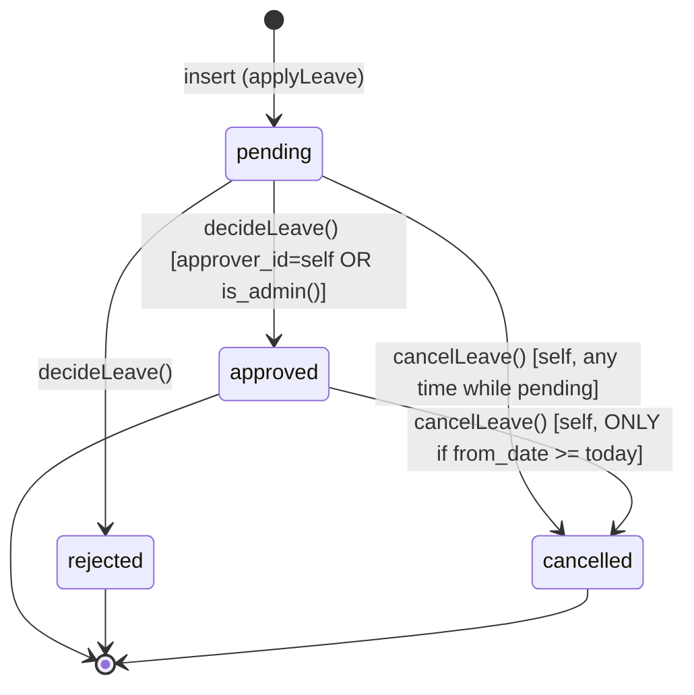
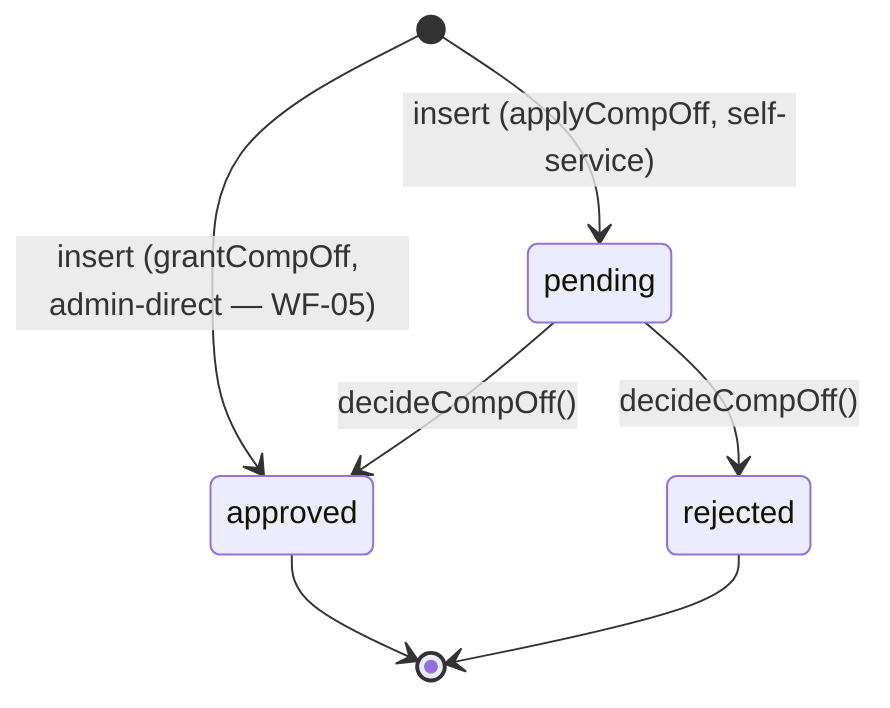
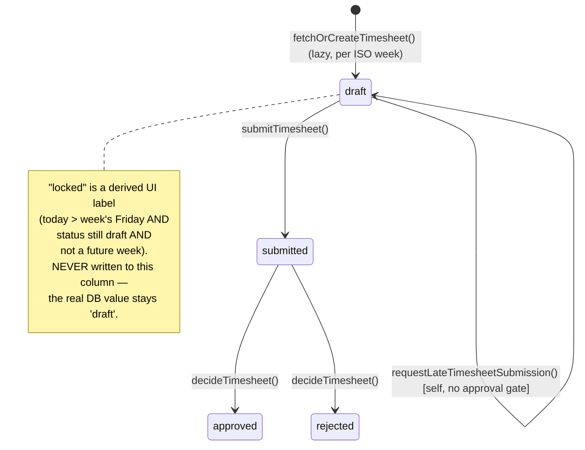
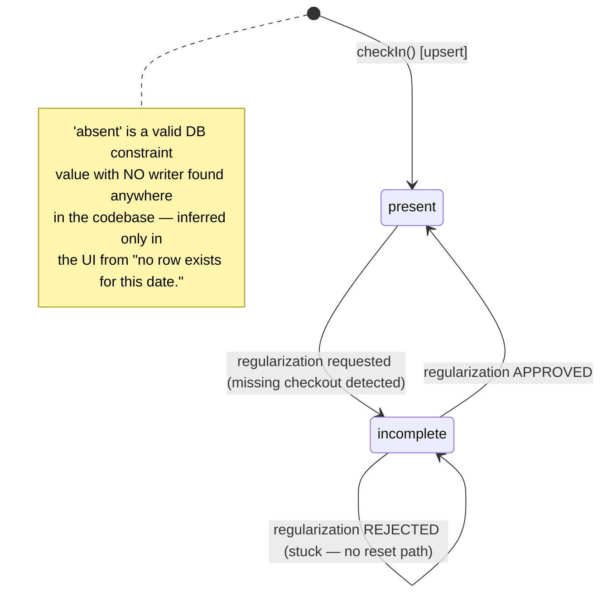
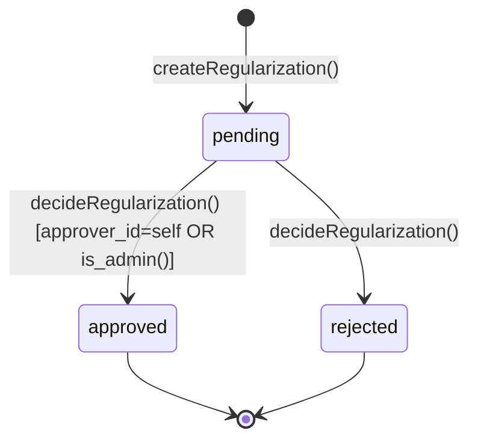
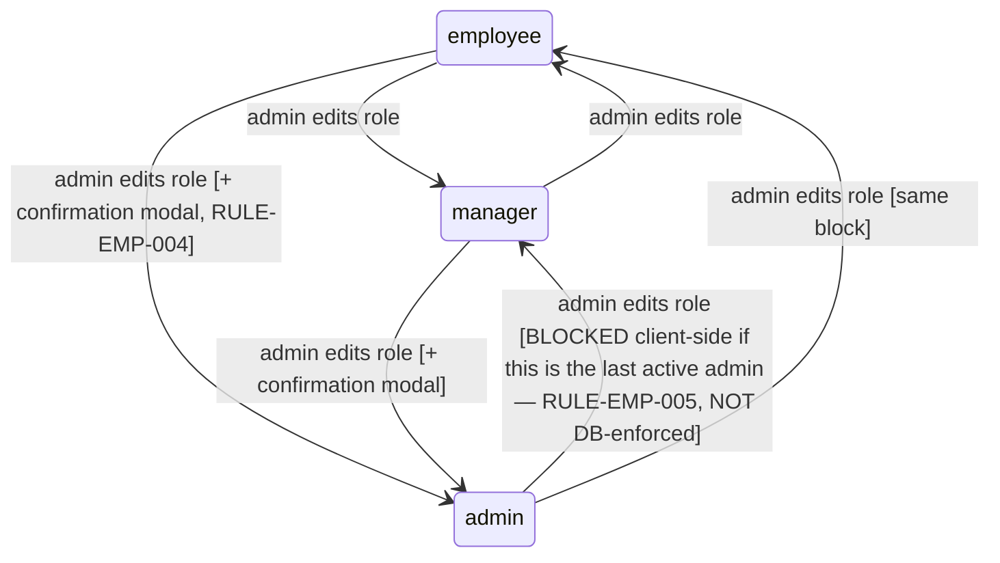
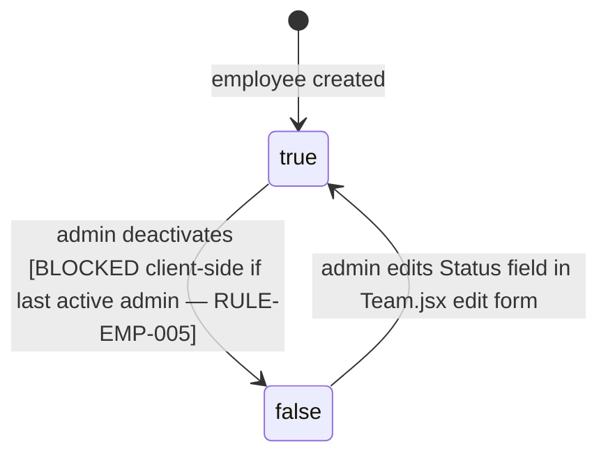
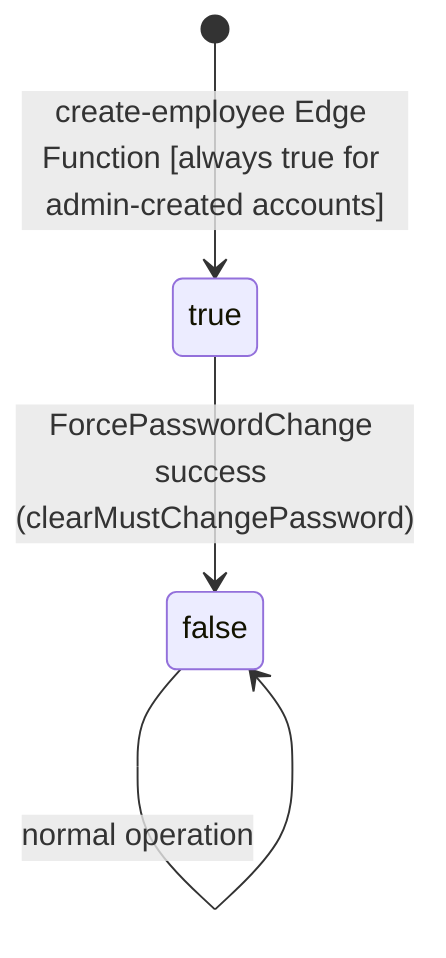

# 07. State Machines

Every status field in the schema, its actual DB check constraint, every writer found in code, and — critically — any state that's UI-only (never persisted) or persisted-but-never-transitioned. Cross-referenced with `08_BUSINESS_RULES.md`.

## 1. `leave_requests.status`

DB check: `status IN ('pending','approved','rejected','cancelled')` (`schema.sql:93`). Cancellation transition is trigger-gated (`enforce_leave_cancellation()`) — the two `→ cancelled` edges are the **only** transitions a non-approver/non-admin employee may ever perform, and every other column must be unchanged in that same update. No transition ever leaves `cancelled`, `approved`, or `rejected` — all three are terminal.

## 2. `comp_off_requests.status`

DB check: `status IN ('pending','approved','rejected')` (`schema.sql:122`). **No `cancelled` value exists** — once submitted, an employee cannot withdraw a comp-off request (RULE-CO-009). Admin's WF-05 grant path is the only way to enter `approved` directly, skipping `pending` entirely.

## 3. `timesheets.status` (+ UI-only pseudo-state)

DB check: `status IN ('draft','submitted','approved','rejected')` (`schema.sql:555-556`) — **`'locked'` is not a valid DB value at all**, purely a client-computed display state (`Timesheet.jsx:258,331`). Note `rejected` has no explicit code path shown returning to `draft` other than the same late-submission-request function used for locked timesheets — meaning a rejected timesheet and a merely-locked-past-deadline timesheet are unlocked by the identical action.

## 4. `attendance.status`

DB check: `status IN ('present','incomplete','absent')` (`schema.sql:544-545`). Two real gaps visible directly in the diagram: (a) `incomplete` has no exit on rejection — RULE-AT-009; (b) `absent` is unreachable by any write path — RULE-AT-006.

## 5. `attendance_regularizations.status`

DB check: `status IN ('pending','approved','rejected')` (`schema.sql:660-661`). Simple, no gaps — this is the cleanest state machine in the app.

## 6. `employees.role`

DB check: `role IN ('admin','manager','employee')` (`schema.sql:22`), default `'employee'`. Every transition is DB-audit-logged unconditionally via `trg_audit_role_change` regardless of which UI surface (AdminPanel or Team) triggered it — the one status field in the whole schema with unconditional audit coverage.

## 7. `employees.is_active`

Boolean, default `true`. **No dedicated "Reactivate" UI exists** — reactivation is only reachable through the generic edit form's Status dropdown in `Team.jsx`, not a direct action on the Admin Employees list (`02_USER_PERSONAS.md` Admin pain points).

## 8. `employees.must_change_password`

Boolean, default `false` at the column level, but **every** account creation path forces it to `true` server-side (`create-employee/index.ts:74`) — so in practice every real account starts `true`. This single flag gates the entire app shell (`App.jsx:92`).

## 9. Cross-Cutting Observation

Of the 6 real status fields in the schema, **3 have a UI-only pseudo-state or an unreachable/stuck value** (`timesheets` has "locked", `attendance` has unreachable `'absent'` and a stuck-on-rejection `'incomplete'`). None of these are bugs in the sense of crashing or corrupting data — but they represent state-machine incompleteness worth closing in a future iteration (tracked in `22_GAP_ANALYSIS.md` and `24_IMPLEMENTATION_ROADMAP.md`).
