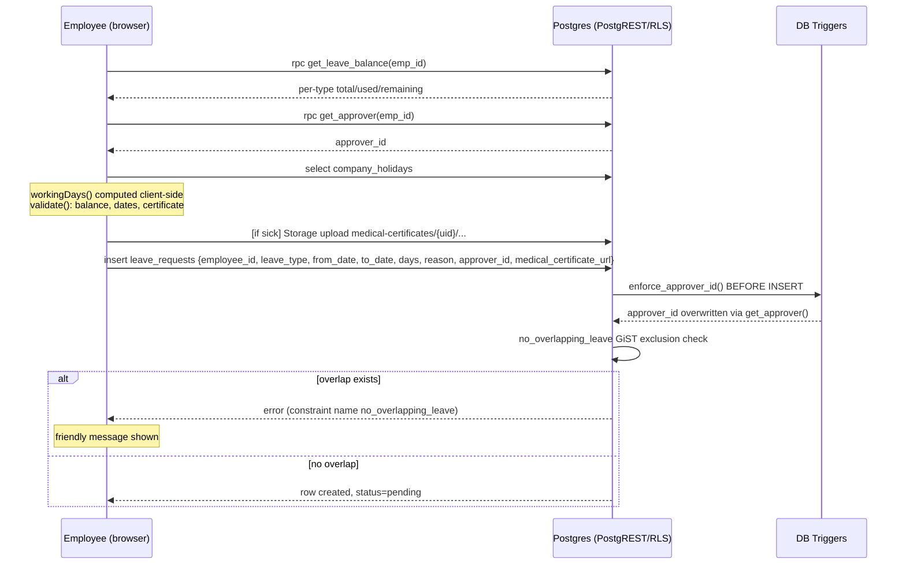
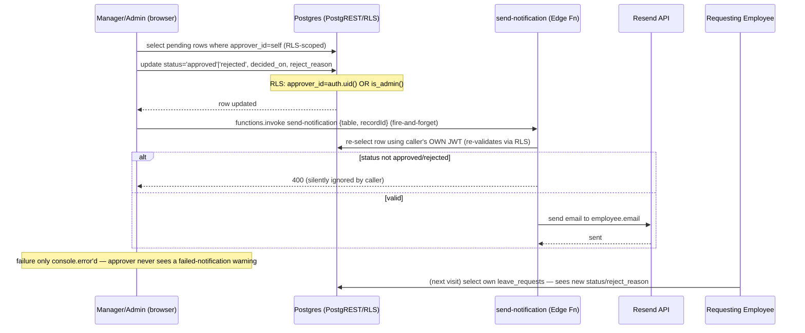
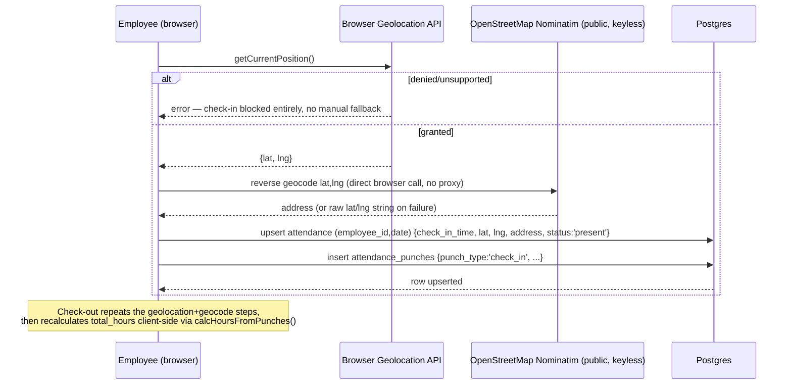
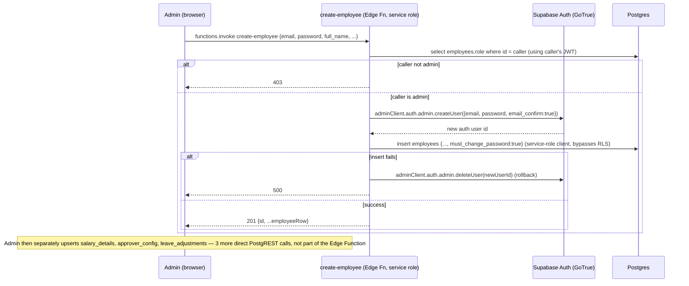
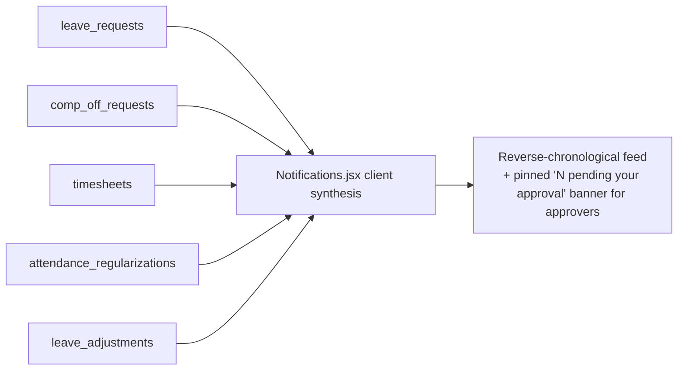

# 12. Data Flow

## 1. General Request Pattern

Every screen follows the same shape: component mounts → `useEffect` fires one or more `api.js` calls in parallel via `Promise.all` → local `useState` holds the result → user interacts → a mutation call fires → local state is optimistically or re-fetch-updated → `onToast()` reports success/failure. There is no global cache/store, so navigating away and back always re-fetches from scratch.

## 2. Leave Application — Data Flow

## 3. Leave/Comp-Off/Timesheet/Regularization Approval — Data Flow

## 4. Attendance Check-In/Out — Data Flow

## 5. Employee Onboarding (Single Add) — Data Flow

## 6. Notifications Feed — Data Flow (client-side synthesis, no dedicated table)

No `notifications` table exists — every visit re-fetches all 5 source tables and re-derives the feed client-side. No read/unread state; nothing is server-persisted about what a user has seen.

## 7. Cross-Cutting Observations

- **No server-side recomputation of client-computed values** in the leave/comp-off/attendance/timesheet flows — `days`, `earned_days`, `total_hours` are all trusted as sent by the client (see `08_BUSINESS_RULES.md` for the full UI-only-vs-DB-enforced breakdown).
- **Notifications are best-effort and invisible on failure** — the only place a network failure to a third party (Resend) is silently swallowed rather than surfaced to the user who took the action.
- **Nominatim is the only third-party call made directly from the browser** rather than proxied through an Edge Function — every other external call (Resend, Jira) goes through a Deno function that holds the actual secret.
